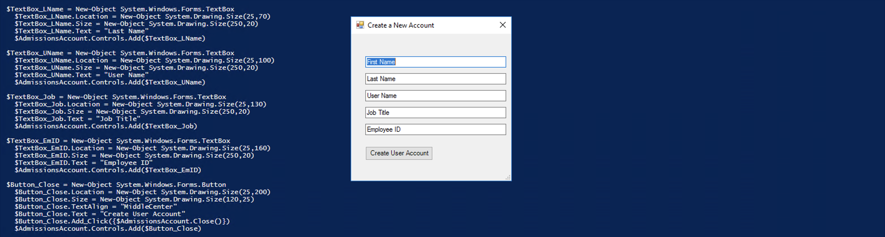

# Powershell-helper
cheat sheet for powershell

### Comments
using # you can add comments

-----

### For documentation and help
```powershell
Function Gather-Info{
<#
.SYNOPSIS
 Collect Details about a lot of Computers
.DESCRIPTION
 This function collects the computer name, operating system, IP addresses and the current date (for historical data in DHCP environments).
.PARAMETER Name
 Specifies the computer name for which the information is collected
.EXAMPLE
 Gather-Info -Name localhost
#>
[CmdletBinding()]
param($vishal)
return $vishal
}
```
run `Get-Help Gather-Info`
output


------
### Giving paramter to function from console

```powershell
 Function advanced2 {
    [CmdletBinding()]Param($Vishal)
    return $Vishal
} 
```
run : `advanced2 abc`

out : `abc`

-----

### Validation in function while accepting paramter

```powershell
 Function advanced2 {
    [CmdletBinding()]Param(
        [Parameter(Mandatory=$True,HelpMessage="Enter two character and two numbers")]
        [ValidatePattern("[a-z][a-z][0-9][0-9]")]
        
    $Vishal)
} 
```

------

### creating dict or hashmap

example 

```powershell
Function Gather-Info {
[CmdletBinding()]
Param()
  $IP4Address=(Get-NetIPAddress).IPAddress
  [array]$IPArray=$IP4Address.split(" ")
  $PCName=(Get-CimInstance -ClassName Win32_ComputerSystem).Name
  $Make=(Get-CimInstance -ClassName Win32_ComputerSystem).Manufacturer
  $OS=(Get-CimInstance -ClassName Win32_OperatingSystem).Caption
  $Today=(Get-Date -Format MM/dd/yyyy)

  $ComputerInformation=@{ComputerName=$PCName;
                     DateOfIP="$Today";
                     IPAddress=$IPArray;
                     OperatingSystem=$OS;
                     Manufacturer="$Make";
                     WaranteeExpiration=[DateTime]"06/30/2020"}

  return $ComputerInformation
  }
  ```
  ----

 ### what if confirm

Function GetSupportProcessExample{
[CmdletBinding(SupportsShouldProcess)]Param()
  Remove-Item -Path .\myfile1.txt
}


More you can read from https://docs.microsoft.com/en-us/powershell/scripting/learn/deep-dives/everything-about-shouldprocess?view=powershell-7.1


-----

### you can use .net functions
example 
```powershell
[System.Media.SystemSounds]::Beep.Play()
```
or you can search on google for particular class like ".net class System sound"

----
### Use can use class in powershell 
example 
```powershell
class Wallet
{

  # Define properties of the Wallet class
  [string] $NameOnID
  [string] $CreditCard1Bank
  [float] $CreditCardBalance
  [string] $DebitCardBank
  [float] $DebitCardAvailFunds
  [int] $CashOnHand

  # Define methods of the wallet class  
  [void] SpendCash([float]$Spent) {
      $this.CashOnHand -= $Spent
    }
  [void] ChargeIt([float]$Charged) {
    $this.CreditCardBalance += $Charged
    }
  [void]ChargeAccount([float]$CardSpend) {
    $this.DebitCardAvailFunds -= $CardSpend
    }
  }


```

run
```powershell

$ScottWallet = [Wallet]::new()

$ScottWallet.NameOnID = 'Scott Miles Burrell'
$ScottWallet.CreditCard1Bank = '1st Bank of Money'
$ScottWallet.CreditCardBalance = 1461.03
$ScottWallet.DebitCardBank = '1st Bank of Money'
$ScottWallet.DebitCardAvailFunds = 2104.84
$ScottWallet.CashOnHand = 145

$ScottWallet.SpendCash(45)

$ScottWallet.ChargeAccount(216.92)
```

-----
### We can call rest api's also
example :
```powershell
Invoke-RestMethod -Method Get -URI http://xyz.com/api/posts/all | Format-Table
```
and general web request
```powershell
Invoke-WebRequest -Method Get -URI http://xyz.com/api/posts/all | Select-Object -ExpandProperty Content | ConvertFrom-Json | Format-Table
```


---
### output as html

```powershell
 Function Get-ExpiringPasswords
  { 
  Get-ADUser -filter {Enabled -eq $True -and PasswordNeverExpires -eq $False} -Properties "DisplayName","msDS-UserPasswordExpiryTimeComputed" |
  
  Where {
    $Difference = New-Timespan (Get-Date) ([datetime]::FromFileTime($_."msDS-UserPasswordExpiryTimeComputed"))
    $Difference.Days -le 45 -and $Difference.Days -ge 0
    } |

  Select-Object -Property "DisplayName",@{Name="Password Expires";Expression={[datetime]::FromFileTime($_."msDS-UserPasswordExpiryTimeComputed")}}
  }


$Header = @"
<style>
TABLE {border-width: 1px; border-style: solid; border-color: black; border-collapse: collapse;}
TH {border-width: 1px; padding: 3px; border-style: solid; border-color: black; background-color: #6495ED;}
TD {border-width: 1px; padding: 3px; border-style: solid; border-color: black;}
</style>
"@


Get-ExpiringPasswords |
ConvertTo-Html -Head $Header | 
Out-File 'C:\Users\DEV\Documents\powershell Learn\output\output.html' 

```

----
### GUI

```powershell
Add-Type -AssemblyName System.Windows.Forms
Add-Type -AssemblyName System.Drawing

$AdmissionsAccount = New-Object System.Windows.Forms.Form
  $AdmissionsAccount.Text = "Create a New Account"
  $AdmissionsAccount.Size = New-Object System.Drawing.Size(300,300)
  $AdmissionsAccount.MaximizeBox = $false
  $AdmissionsAccount.MinimizeBox = $false
  $AdmissionsAccount.ControlBox = $true

$TextBox_FName = New-Object System.Windows.Forms.TextBox
  $TextBox_FName.Location = New-Object System.Drawing.Size(25,40)
  $TextBox_FName.Size = New-Object System.Drawing.Size(250,20)
  $TextBox_FName.Text = "First Name"
  $AdmissionsAccount.Controls.Add($TextBox_FName)

$TextBox_LName = New-Object System.Windows.Forms.TextBox
  $TextBox_LName.Location = New-Object System.Drawing.Size(25,70)
  $TextBox_LName.Size = New-Object System.Drawing.Size(250,20)
  $TextBox_LName.Text = "Last Name"
  $AdmissionsAccount.Controls.Add($TextBox_LName)

$TextBox_UName = New-Object System.Windows.Forms.TextBox
  $TextBox_UName.Location = New-Object System.Drawing.Size(25,100)
  $TextBox_UName.Size = New-Object System.Drawing.Size(250,20)
  $TextBox_UName.Text = "User Name"
  $AdmissionsAccount.Controls.Add($TextBox_UName)

$TextBox_Job = New-Object System.Windows.Forms.TextBox
  $TextBox_Job.Location = New-Object System.Drawing.Size(25,130)
  $TextBox_Job.Size = New-Object System.Drawing.Size(250,20)
  $TextBox_Job.Text = "Job Title"
  $AdmissionsAccount.Controls.Add($TextBox_Job)
  
$TextBox_EmID = New-Object System.Windows.Forms.TextBox
  $TextBox_EmID.Location = New-Object System.Drawing.Size(25,160)
  $TextBox_EmID.Size = New-Object System.Drawing.Size(250,20)
  $TextBox_EmID.Text = "Employee ID"
  $AdmissionsAccount.Controls.Add($TextBox_EmID)
  
$Button_Close = New-Object System.Windows.Forms.Button
  $Button_Close.Location = New-Object System.Drawing.Size(25,200)
  $Button_Close.Size = New-Object System.Drawing.Size(120,25)
  $Button_Close.TextAlign = "MiddleCenter"
  $Button_Close.Text = "Create User Account"
  $Button_Close.Add_Click({$AdmissionsAccount.Close()})
  $AdmissionsAccount.Controls.Add($Button_Close)

$AdmissionsAccount.Add_Shown({$AdmissionsAccount.Activate()})
[Void]$AdmissionsAccount.ShowDialog()

$NewUser = [ordered]@{FirstName=($TextBox_FName).Text; LastName=($TextBox_LName).Text; Username=($TextBox_UName).Text;  Title=($TextBox_Job).Text; Employee=($TextBox_EmID).Text}

Return $NewUser
```


-------
### Read from csv 
```csv
DisplayName,EmailAddress,EmployeeID
Spencer Espinoza,sespinoza@landonhotel.com,Es7144
Campbell Manning,cmanning@landonhotel.com,Ma2003
Houston Cox,hcox@landonhotel.com,Co5453
Brisa Odonnell,bodonnell@landonhotel.com,Od7627
```
```powershell
Function displayFromCSV {
    [CmdletBinding()]Param(
        [Parameter(Mandatory=$True,ValueFromPipelineByPropertyName=$True)]
        [ValidatePattern("[a-z][a-z][0-9][0-9]")]
        
    $EmployeeID)

    #Process will loop
    Process{
    Write-Host $EmployeeID
    }
} 


```

---
### Read data from xml
```xml
<?xml version="1.0"?>
<roster>
  <employee id="010101">
    <name>Robertson, Robert</name>
    <jobdescription>VP of Sales</jobdescription>
    <date_of_hire>09/16/1998</date_of_hire>
    <email_address>rrobertson@landonhotel.com</email_address>
    <pe_3month>12/21/1998 Exceeds</pe_3month>
    <pe_1year>09/17/1999 Exceeds</pe_1year>
    <pe_5year>09/21/2003 Exceeds</pe_5year>
    <pe_10year>09/19/2008 Meets</pe_10year>
    <pe_15year>09/16/2013 Exceeds</pe_15year>
    <pe_20year>09/17/2018 Exceeds</pe_20year>
  </employee>
</roster>
```

```powershell
$XMLPath = 'C:\ScriptOutput\roster.xml'
$EmployeeRoster = [xml](Get-Content $XMLPath) 
#format in table
$EmployeeRoster.roster.employee | Format-Table
$EmployeeRoster.SelectSingleNode("//employee[8]")
# Place the workspace in a variable
$Bernie = $EmployeeRoster.roster.employee[7]
# Update an existing element
$Bernie.jobdescription = 'Landscaping'
# Save changes
$EmployeeRoster.Save($XMLPath)
```

---
### read from json
```powershell
@"
 [ 
  {
    "FirstName": "Robert",
    "LastName": "Robertson",
    "EmployeeID": 010101,
    "DateOfHire": {
      "Month": "September",
      "Day": 16,
      "Year": 1998
      },
    "SkillSets": [
      "Sales",
      "Social Media Marketing",
      "Public Speaking",
      "Clarinet"
      ],
    "Management": true,
    "LastUpdate": "\/Date(1540112320855)\/"
  },
  {
    "FirstName": "Janice",
    "LastName": "Jansdotter",
    "EmployeeID": 020202,
    "DateOfHire": {
      "Month": "May",
      "Day": 1,
      "Year": 2002
      },
    "SkillSets": [
      "Image Marketing",
      "Social Media Marketing",
      "Advertizing",
      "Trombone"
      ],
    "Management": true,
    "LastUpdate": "\/Date(1539012320855)\/"
  },
  {
    "FirstName": "Elena",
    "LastName": "Warren",
    "EmployeeID": 070707,
    "DateOfHire": {
      "Month": "August",
      "Day": 11,
      "Year": 2011
      },
    "SkillSets": [
      "Customer Service",
      "Training",
      "Party Planning",
      "Bonzai Trees"
      ],
    "Management": false,
    "LastUpdate": "\/Date(1540002320855)\/"
  }
 ]
"@ | ConvertFrom-Json | Format-Table
```

